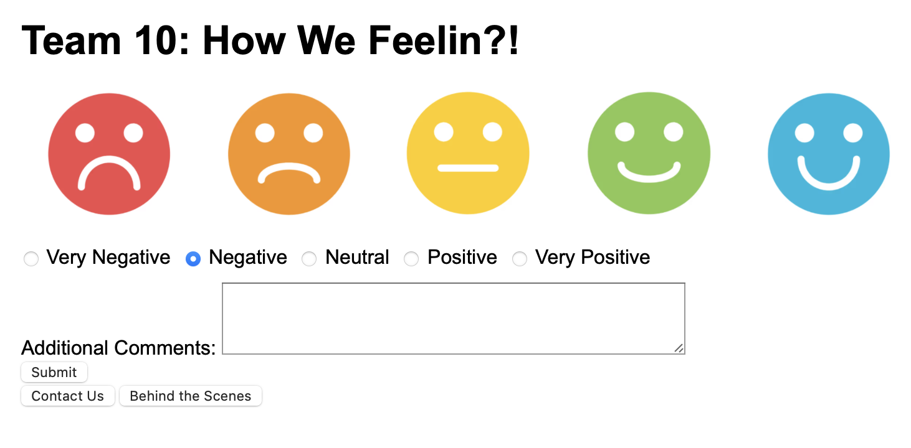
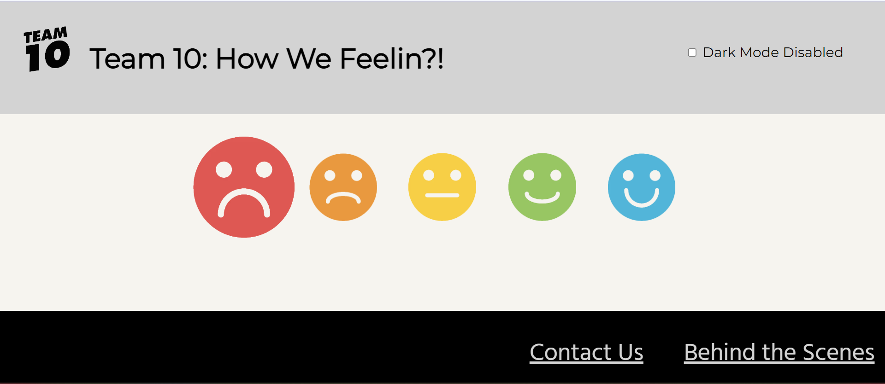
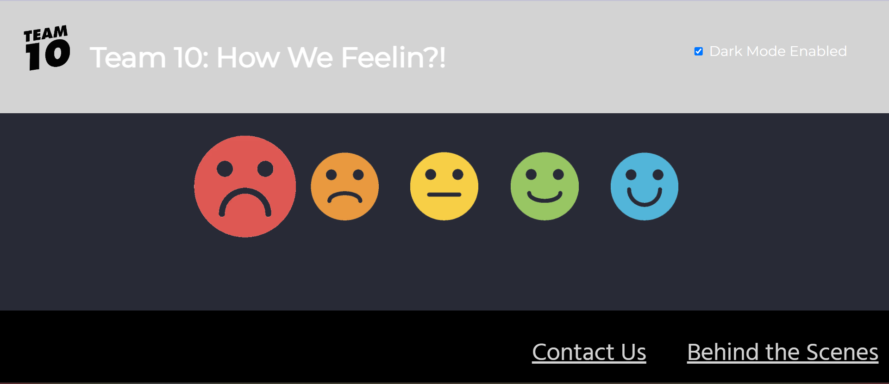

# Process

This documentation shall look to highlight the process that took place when creating the sentiment 
widget.

We will divide this documentation into three portions: tending to user stories, snapshots tackling user stories and snapshots taking our own advise into account.

## Tending to user stories

To help tackle user stories, we decided to create 5 issues in our github repo, each pertaining to each of the 5 user stories.

To solve each of the user stories, we had decided to present the user stories issue as tackling a set of sub-problems.

For example, consider the following user story:

**User story**
As a user, I want to be able to share further feedback in text.

**Acceptance criteria****[Same as sub-problems created to incorporate user's wishes]**
- Criterion 1: Have a text box appear when a user clicks an icon indicating a submission of a sentiment
- Criterion 2: Along with a submit button
- Criterion 3: Once a user submits a text response, the page should show some confirmation that this has been sent.

To see how we have structured other user stories, look at issues tab and find for issues which has the following template: STORY "Number"

## Snapshots tackling user stories

Consider the above user story which states that the user would like to have the ability to share further feedback into text.

There also exists another user story which asks for customizable accessibility options which involves 
the ability to switch between the light and dark mode.

## Snapshots tackling creator stories

The first thing we implemented from our own recommendations was the range of icons from smiley to sad
which is clearly highlighted in the above images.

Another thing we implemented from our own recommendations is the "contact us" bottom which again is clearly highlighted in the above images.

